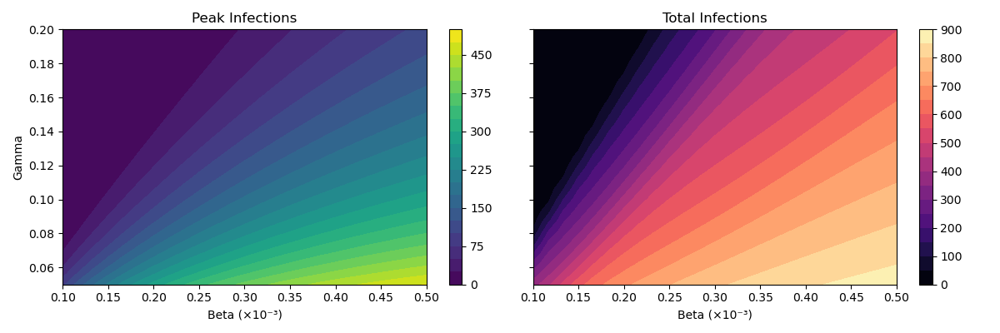

# HW 1: SIR and SEIR Model Implementation for Pandemic Spread
* Name: Kaixuan Liu
* Contact: kaixuan.liu@emory.edu
* Question number: HW1

# Part A: 

* All differential equations were solved using scipy.integrate.solve_ivp

# Part B & C: 
* Dynamics of the SIR Model: 
Within 150 days, the SIR model shows a outbreak of the epidemic. The susceptible individuals (S) were exhausted, the infected individuals (I) reached their peak, and the recovered individuals (R) increased and stabilized. 
* Epidemic peak: 
The number of infections peaked on the 37.05th day, approximately 298 people. 
* $R_0$: 
It was calculated that $R_0 \approx 2.997$. Since $R_0 > 1$, the disease successfully triggered an outbreak in the population.

# Part D: SEIR Model 
* Epidemic Wave: 
The 365-day and 1200-day simulations show that the epidemic has not completely subsided due to the continuous replenishment of susceptible individuals through the birth rate. 

* Long-term trend: The infection curve shows a gradually decaying wave. In the 1200-day simulation, the four groups of people (S, E, I, R) eventually reached a stable endemic equilibrium state, rather than completely disappearing. 

* The impact of E compartment: Introducing the exposed compartment creates a delay period between exposure to the virus and becoming an infected individual, which is more like reality.
.png)

* The impact of birth and death rates:
Births will continuously create new susceptible populations, preventing diseases from completely disappearing. Deaths will reduce the number of people in all categories, maintaining the balance of the total population. These two processes work together, causing periodic fluctuations in the epidemic situation, but the fluctuations will gradually weaken. Eventually, the disease will be at a lower level over the long term, rather than completely disappearing.

# Part E: Sensitivity Analysis:
The results shown in the plot blow:

$\beta$ represents the transmission rate, which is related to social distancing, mask usage, lockdowns, and other epidemic prevention measures. Reducing $\beta$ can slow down the spread and lower the peak. 
$\gamma$ represents the recovery rate, which is related to medical resources, the efficacy of drugs and vaccines. Increasing $\gamma$ will enable infected individuals to recover more quickly and reduce the transmission time. 
Overall, reducing $\beta$ and increasing $\gamma$ is the most effective control strategy, as it can both lower the peak of the epidemic and reduce the total number of infections.

# Correlation with model-based machine learning:
This project, through the classic case of SIR/SEIR, shows the core idea of "model-based machine learning": we do not directly learn from the data, but first establish a mathematical model (a system of differential equations in this case). Then, we use simulation of this model to predict the future dynamics of the system. In more advanced applications, we will use real data to fit the parameters of the model (such as $\beta, \gamma$). 

# Future improvement suggestions:
we can use real epidemic data to fit the parameters of the model, making the predictions more accurate.

# AI Disclaimer

**Disclaimer:** Gemini was used to complete HW #1.[PART-A] to ask two main questions:
1.  how to establish and solve a general differential equations in Python, specifically asking if existing packages were available and how to use them explain it in a short word.
2.  how to set the interval of the integral and pass other parameters to the solver function.

Gemini provided the Python code implementation for solving the differential equations based on these questions.
